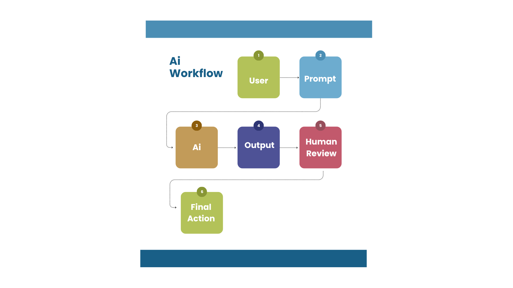

# AI Knowledge Assistant Workflow Study

This project explores how generative AI tools can support research, documentation, and productivity workflows.

## Objective
To evaluate how AI can function as a knowledge assistant in professional environments.

## Workflow Diagram

## Tools Used
- ChatGPT
- Claude
- Gemini

## Focus Areas
- Prompt engineering
- Workflow testing
- Productivity enhancement
- AI output evaluation

## Outcome
This study demonstrates how structured prompts can improve AI performance in knowledge-based tasks.
